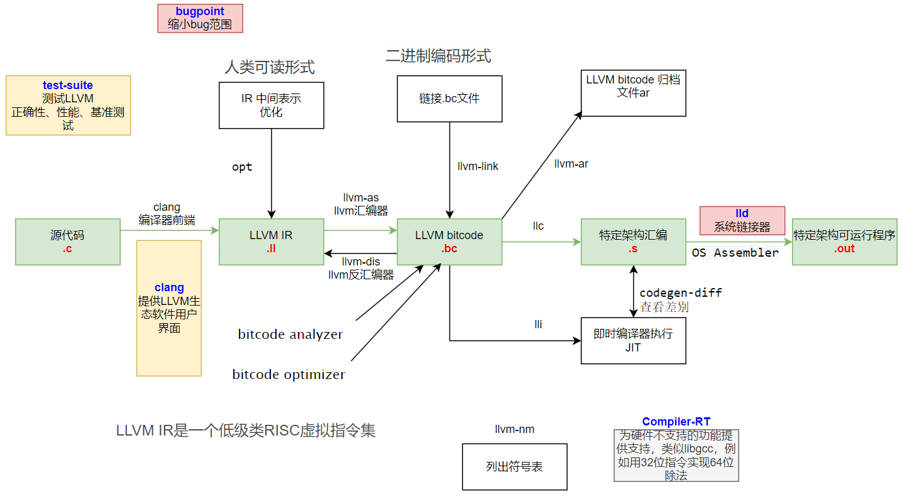
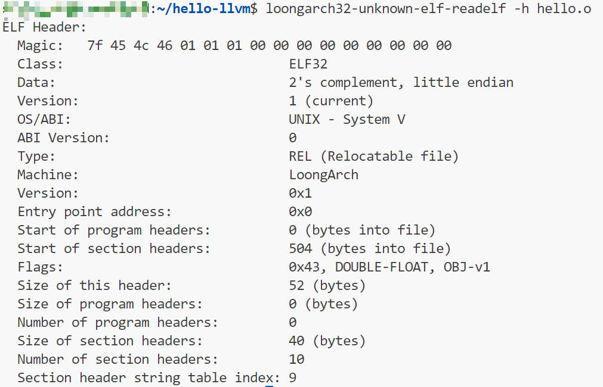

# loongarch32 程序编译分析

## 为啥搞这个呢？

loongarch64的基础设施已经比较完善了，目前（2024年8月18日05:47:32）支持LA64架构的LA464、LA664的IP核，代表的处理器是LS3A5000、LS3A6000系列处理器。

而LA264内核的2K0300、2K0500尚未官方支持，但是编译基本上不成大问题。

大问题在于LoongArch32,32位的处理器核1C102、1C103等嵌入式方向的芯片，目前还不能进入“新世界”，需要用GCC8.3.0编译器系列。

为了想用一些现代化的方式进行龙芯嵌入式编程，例如使用Zig和Rust，而这两者都基于LLVM编译器后端进行实现。

## 新工具链尝试

于是就需要尝试编译工具链了。

### 成功尝试

1. 自编译binutils 2.43 ,得到loongarch32-unknown-elf，暂时可用，未深度测试。
2. 自编译llvm19.1.0-rc2，得到clang、ld.lld

### 失败尝试

1. 编译gcc14.2.0，暂时不支持loongarch32。（上游很活跃，有需要的时候能很快加上，本人才疏学浅肝不动了）

# 如何将hello.c编译为loongarch32的可执行文件？

首先，我学习了一波编译原理和各种工具链，发现要进行如下步骤：



## 编译为LLVM IR

``` bash
clang -o3  --target=loongarch32 -emit-llvm hello.c -S -o hello.ll
```

## 编译为字节码bitcode文件

``` bash
llvm-as hello.ll
```

## 编译为二进制文件

``` bash
llc --mtriple=loongarch32 --mattr=+d --target-abi=ilp32f hello.bc
```

得到了一个hello.S

## 生成目标文件

``` bash
loongarch32-unknown-elf-as hello.s -o hello.o
```

查看elf文件头

``` bash
loongarch32-unknown-elf-readelf -h hello.o
```



查看全部内容

``` bash
loongarch32-unknown-elf-readelf -a hello.o
```

内容：

``` bash
ELF Header:
  Magic:   7f 45 4c 46 01 01 01 00 00 00 00 00 00 00 00 00 
  Class:                             ELF32
  Data:                              2's complement, little endian
  Version:                           1 (current)
  OS/ABI:                            UNIX - System V
  ABI Version:                       0
  Type:                              REL (Relocatable file)
  Machine:                           LoongArch
  Version:                           0x1
  Entry point address:               0x0
  Start of program headers:          0 (bytes into file)
  Start of section headers:          504 (bytes into file)
  Flags:                             0x43, DOUBLE-FLOAT, OBJ-v1
  Size of this header:               52 (bytes)
  Size of program headers:           0 (bytes)
  Number of program headers:         0
  Size of section headers:           40 (bytes)
  Number of section headers:         10
  Section header string table index: 9

Section Headers:
  [Nr] Name              Type            Addr     Off    Size   ES Flg Lk Inf Al
  [ 0]                   NULL            00000000 000000 000000 00      0   0  0
  [ 1] .text             PROGBITS        00000000 000040 000064 00  AX  0   0 32
  [ 2] .rela.text        RELA            00000000 0001a0 00000c 0c   I  7   1  4
  [ 3] .data             PROGBITS        00000000 0000a4 000000 00  WA  0   0  1
  [ 4] .bss              NOBITS          00000000 0000a4 000000 00  WA  0   0  1
  [ 5] .comment          PROGBITS        00000000 0000a4 00006a 01  MS  0   0  1
  [ 6] .note.GNU-stack   PROGBITS        00000000 00010e 000000 00      0   0  1
  [ 7] .symtab           SYMTAB          00000000 000110 000080 10      8   7  4
  [ 8] .strtab           STRTAB          00000000 000190 00000e 00      0   0  1
  [ 9] .shstrtab         STRTAB          00000000 0001ac 00004a 00      0   0  1
Key to Flags:
  W (write), A (alloc), X (execute), M (merge), S (strings), I (info),
  L (link order), O (extra OS processing required), G (group), T (TLS),
  C (compressed), x (unknown), o (OS specific), E (exclude),
  D (mbind), p (processor specific)

There are no section groups in this file.

There are no program headers in this file.

There is no dynamic section in this file.

Relocation section '.rela.text' at offset 0x1a0 contains 1 entry:
 Offset     Info    Type            Sym.Value  Sym. Name + Addend
00000000  00000066 R_LARCH_ALIGN                1c

The decoding of unwind sections for machine type LoongArch is not currently supported.

Symbol table '.symtab' contains 8 entries:
   Num:    Value  Size Type    Bind   Vis      Ndx Name
     0: 00000000     0 NOTYPE  LOCAL  DEFAULT  UND 
     1: 00000000     0 FILE    LOCAL  DEFAULT  ABS hello.c
     2: 00000000     0 SECTION LOCAL  DEFAULT    1 .text
     3: 00000000     0 SECTION LOCAL  DEFAULT    3 .data
     4: 00000000     0 SECTION LOCAL  DEFAULT    4 .bss
     5: 00000000     0 SECTION LOCAL  DEFAULT    6 .note.GNU-stack
     6: 00000000     0 SECTION LOCAL  DEFAULT    5 .comment
     7: 0000001c    72 FUNC    GLOBAL DEFAULT    1 main

No version information found in this file.
```

### 查看符号表

``` bash
loongarch32-unknown-elf-nm hello.o
```

输出``0000001c T main``

## 链接

``` bash
loongarch32-unknown-elf-ld -A loongarch32 hello.o
```

输出：

``` bash
loongarch32-unknown-elf-ld: warning: cannot find entry symbol _start; defaulting to 00010080
```

并且有一个a.out文件出来。用``loongarch32-unknown-elf-nm a.out``查看``a.out``：
会发现

``` bash
000140c8 T __bss_start
000140c8 T _edata
000140c8 T _end
         U _start
00010080 T main
```

用```loongarch32-unknown-elf-readelf -a a.out```查看elf信息

得到

```bash
ELF Header:
  Magic:   7f 45 4c 46 01 01 01 00 00 00 00 00 00 00 00 00 
  Class:                             ELF32
  Data:                              2's complement, little endian
  Version:                           1 (current)
  OS/ABI:                            UNIX - System V
  ABI Version:                       0
  Type:                              EXEC (Executable file)
  Machine:                           LoongArch
  Version:                           0x1
  Entry point address:               0x10080
  Start of program headers:          52 (bytes into file)
  Start of section headers:          532 (bytes into file)
  Flags:                             0x43, DOUBLE-FLOAT, OBJ-v1
  Size of this header:               52 (bytes)
  Size of program headers:           32 (bytes)
  Number of program headers:         2
  Size of section headers:           40 (bytes)
  Number of section headers:         6
  Section header string table index: 5

Section Headers:
  [Nr] Name              Type            Addr     Off    Size   ES Flg Lk Inf Al
  [ 0]                   NULL            00000000 000000 000000 00      0   0  0
  [ 1] .text             PROGBITS        00010080 000080 000048 00  AX  0   0 32
  [ 2] .comment          PROGBITS        00000000 0000c8 000069 01  MS  0   0  1
  [ 3] .symtab           SYMTAB          00000000 000134 000090 10      4   4  4
  [ 4] .strtab           STRTAB          00000000 0001c4 000026 00      0   0  1
  [ 5] .shstrtab         STRTAB          00000000 0001ea 00002a 00      0   0  1
Key to Flags:
  W (write), A (alloc), X (execute), M (merge), S (strings), I (info),
  L (link order), O (extra OS processing required), G (group), T (TLS),
  C (compressed), x (unknown), o (OS specific), E (exclude),
  D (mbind), p (processor specific)

There are no section groups in this file.

Program Headers:
  Type           Offset   VirtAddr   PhysAddr   FileSiz MemSiz  Flg Align
  LOAD           0x000000 0x00010000 0x00010000 0x000c8 0x000c8 R E 0x4000
  GNU_STACK      0x000000 0x00000000 0x00000000 0x00000 0x00000 RW  0x10

 Section to Segment mapping:
  Segment Sections...
   00     .text 
   01     

There is no dynamic section in this file.

There are no relocations in this file.

The decoding of unwind sections for machine type LoongArch is not currently supported.

Symbol table '.symtab' contains 9 entries:
   Num:    Value  Size Type    Bind   Vis      Ndx Name
     0: 00000000     0 NOTYPE  LOCAL  DEFAULT  UND 
     1: 00010080     0 SECTION LOCAL  DEFAULT    1 .text
     2: 00000000     0 SECTION LOCAL  DEFAULT    2 .comment
     3: 00000000     0 FILE    LOCAL  DEFAULT  ABS hello.c
     4: 00000000     0 NOTYPE  GLOBAL DEFAULT  UND _start
     5: 000140c8     0 NOTYPE  GLOBAL DEFAULT    1 __bss_start
     6: 00010080    72 FUNC    GLOBAL DEFAULT    1 main
     7: 000140c8     0 NOTYPE  GLOBAL DEFAULT    1 _edata
     8: 000140c8     0 NOTYPE  GLOBAL DEFAULT    1 _end

No version information found in this file.
```

### 使用LLD链接

```bash
ld.lld hello.bc -o hello.out
```

会有报错警告：

```bash
warning: the triple-implied ABI is invalid, ignoring and using feature-implied ABI
warning: 'ilp32s' has not been standardized
ld.lld: warning: cannot find entry symbol _start; not setting start address
```

他在说，哦这个ABI是非法的无效的，ilp32s也是还没标准化的，但是我可以给你生成出来结果。
然后ld.lld没有找到入口符号_start，没有设置start地址。这需要和linker.ld结合起来才行。

在没有指定linker.ld文件的时候，binutils编译出来的loongarch32-unknown-elf-ld会比较好一些，会自动添加默认地址。同时各种段也安排好了。
